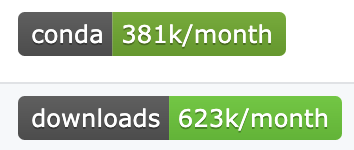
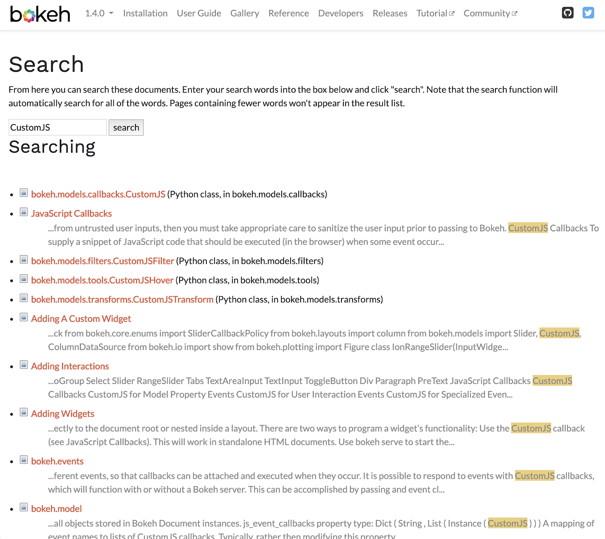
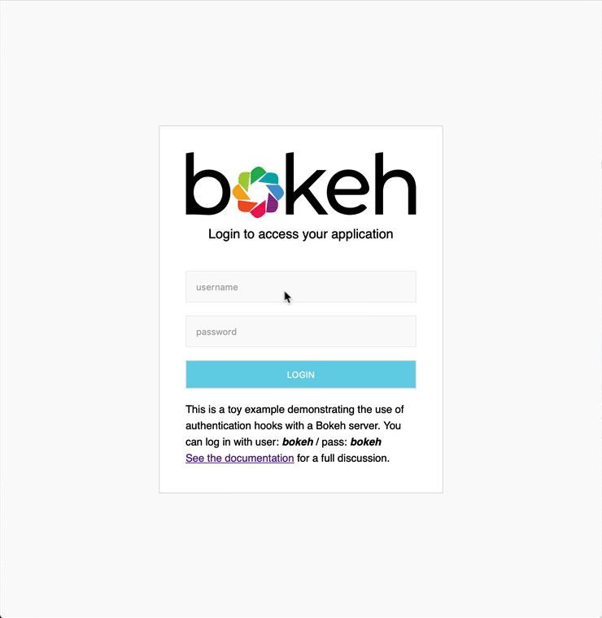

**We are pleased to announce the release of Bokeh 1.4!**

Highlights include:

* **Searchable Docs!** This is a big deal and has been a long time coming. [**``#8209``**](https://github.com/bokeh/bokeh/issues/8209)
* **New docs site theme!** This is a fresh new look for our docs site, and looks great on mobile devices. We couldn’t have done it without [Joris Van den Bossche](https://twitter.com/jorisvdbossche)&mdash; more on that further down.
* **Bokeh Server security features!** Native SSL termination, support for cross-site cookie protection, and the ability to add authentication flows to protect your Bokeh app with a login. [**``#9139``**](https://github.com/bokeh/bokeh/issues/9139), [**``#9140``**](https://github.com/bokeh/bokeh/issues/9140)
* **Embedding Bokeh applications directly in Django!** No Tornado necessary if you're already working with Django! [**``#9009``**](https://github.com/bokeh/bokeh/issues/9009)
* **New, more direct JupyterLab/Ipywidgets Integrations!** [**``#9137``**](https://github.com/bokeh/bokeh/issues/9137)

For full details, see the [CHANGELOG](https://github.com/bokeh/bokeh/blob/master/CHANGELOG)
and [Release Notes](https://docs.bokeh.org/en/latest/docs/releases.html).
Additionally, examples for each release are uploaded to CDN.
[Click here to download](https://cdn.bokeh.org/bokeh/examples/examples-1.4.0.zip).

If you are using
[Anaconda](https://www.anaconda.com/downloads), Bokeh can most easily be installed
by executing the command ``conda install -c bokeh bokeh`` . Otherwise, use
``pip install bokeh``.

-----

### Announcements

**This is the last Bokeh release to support Python 2.** Starting with Bokeh 2.0, only Python version 3.6 and up will be supported.

Bokeh passed quite a milestone in October: our [Github repo](https://github.com/bokeh/bokeh) showed that in a month, there were over one million Bokeh package installs. That’s great to see!

We’ve seen some great examples of Bokeh in action on our [Discourse site](discourse.bokeh.org) this month. For some inspiring data visualization case studies, you may want to check out:
* anthonydouc’s [Interactive Water Supply Optimisation app](https://discourse.bokeh.org/t/interactive-water-supply-optimisation-application/4087), with a link to the interactive tool! anthonydouc says that the app “makes extensive use of embedding bokeh elements in a custom template using bootstrap, which was a great feature brought in that enabled this entire app so a big thank you to all the devs!”
* jcacabelos’s [Crossplatform Tool for 1st Quality Control on Hydrographic Cruise Data](https://discourse.bokeh.org/t/crossplatform-tool-for-1st-quality-control-on-hydrographic-cruise-data/3706), a demo of a highly interactive Bokeh app embedded with Electron. jcacabelos links to the project in GitHub, and there’s a good discussion on the Discourse about the logistics of the Electron embedding.

**If you've built something with Bokeh, we'd love to see it and share it with our community!** The [Showcase section of our Discourse site](https://discourse.bokeh.org/c/showcase) is dedicated to examples of Bokeh in action. It's always exciting to see data visualizations done well, and tools and ideas used in innovative ways.

-----

### New Features

##### Searchable Docs

Search has been restored to the Bokeh documentation site! We are looking to migrate to an ad-free Google Custom Search Engine in the near future; for now, search is implemented using a client-side JavaScript search capability. You should be able to find what you’re looking for on [docs.bokeh.org](docs.bokeh.org) without searching externally. Give it a shot and [let us know what you think](discourse.bokeh.org)-- we want to hear your feedback!

##### New Docs Site Theme

While you’re checking out that new search capability, take a look at our clean, fresh new theme for [the documentation site](docs.bokeh.org). This beautiful makeover was made possible by [**Joris Van den Bossche**](https://twitter.com/jorisvdbossche), who shared some work he’s done on theming docs for [pandas](https://pandas.pydata.org/).

The new theme is also mobile-friendly! Click around, and again, let us know what you think-- we’ve got a [Discourse thread](https://discourse.bokeh.org/t/new-theme-for-bokeh-1-4/4154) going to discuss ideas and observations, and we’d love to hear from you.

##### Bokeh Server Security Features

* Native SSL termination is now supported when using the standard Tornado-based Bokeh server. This simplifies the process of setting up HTTPS connections to Bokeh apps; previously this had required a complicated setup behind a reverse proxy. [See the docs for details on how to set up SSL Termination.](https://docs.bokeh.org/en/dev/docs/user_guide/server.html#ssl-termination)
* Support for cross-site cookie protection has been added, making use of [Tornado's built-in XSRF protection](https://www.tornadoweb.org/en/stable/guide/security.html#cross-site-request-forgery-protection). Adding this feature is as simple as adding a command option or environment variable; [details on how to do this are in the docs.](https://docs.bokeh.org/en/dev/docs/user_guide/server.html#xsrf-cookies)
* New auth hooks have been added to support logging in and out of Bokeh Server apps, making use of Tornado’s ``RequestHandler.get_current_user`` method. This enables developers to create private applications protected by a username/password. [Information on how to implement this can be found in the docs](https://docs.bokeh.org/en/dev/docs/user_guide/server.html#authentication), and we also have a [working example on GitHub.](https://github.com/bokeh/bokeh/tree/master/examples/howto/server_auth)

##### JupyterLab / iPyWidgets Integrations

With the updated ``jupyter_bokeh`` extension, it is now possible to render Bokeh figures and
widgets as ipywidgets or use them in ipywidget layouts. This allows for much more fluid,
programmatic interaction between Bokeh and Jupyter components without the need to use
``push_notebook()`` or handle Jupyter comms manually. [Installation instructions can be found here.](https://github.com/bokeh/jupyter_bokeh#installation)

##### Embedding Bokeh Applications in Django

It's now possible to embed Bokeh applications in Django, without need for a separate Tornado process. This is possible because Bokeh server code can now also make use of the Django Channels library for communicating with web browser sessions. *Note that Django integration works only on
Python 3.6+.*

##### Precompiled Bokeh Extensions

It's now possible to create pre-compiled bokeh extensions using the ``bokeh build`` CLI command and ``bokeh.ext.build()`` API. Such extensions are compiled once and can be distributed with Python packages and/or as NPM packages. Note that this feature is provided as a preview and on a provisional basis only. Full and refined support will be available in Bokeh 2.0.

… and more! The complete [list of changes for 1.4.0](https://github.com/bokeh/bokeh/milestone/52?closed=1) can be seen on GitHub.

----
### Coming Up in 2.0

We’ve still got some great new features just around the corner. Here’s what you can expect in the upcoming 2.0 release:

* Ability to specify an expiry (and a not-before time) on session tokens
* Session tokens will no longer be transmitted in HTTP query arguments

... and all the many changes previously outlined in our post, [Preview of 2.0 Changes](https://blog.bokeh.org/posts/preview-2-0).

----

Many thanks to all the new contributors to helped make this great release!

As always, anyone interested in helping out should drop by the
[Dev Chat Channel](https://gitter.im/bokeh/bokeh-dev) and say hello!
